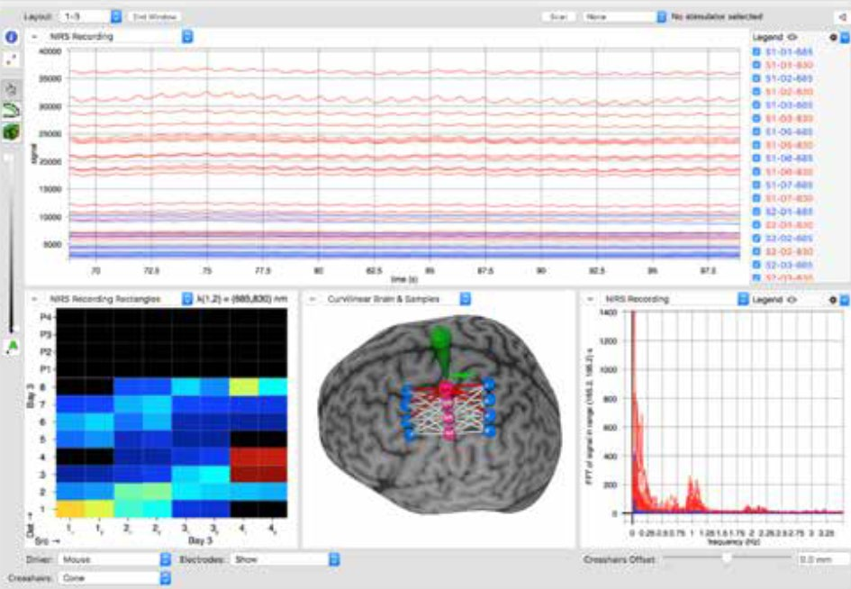
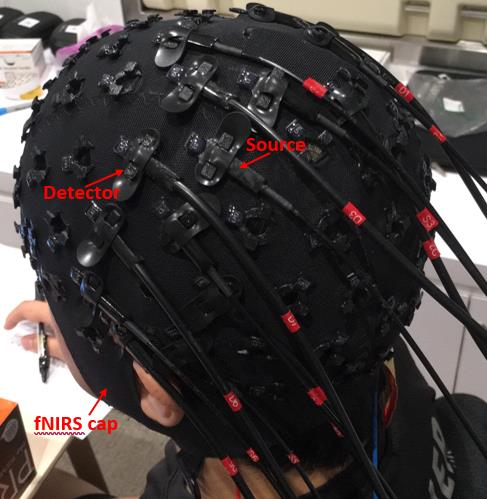

## What is fNIRS?
fNIRS (functional near-infrared spectroscopy) is a non-invasive neuroimaging technique that measures brain responses by recording changes in the amount of oxygenated/deoxygenated blood. 
It works based on the principle of light scattering – the device sends high intensity beams of near-infrared light at the scalp and detects changes to amount of light absorbed within the brain. 
Mathematical algorithms are then applied to process the collected data to calculate changes in oxygenated/deoxygenated haemoglobin concentration. These changes are associated with changes in brain function.

## How is fNIRS Done?
fNIRS is a non-invasive neuroimaging technique that does not require any exposure to radiation or x-rays. To record signals, a fNIRS cap is fitted over the participant’s head. 
The optodes (sources and detectors) are then attached onto the cap. To ensure the optodes sit directly on the scalp, the participant’s hair may be moved to the side.

## What is fNIRS used for?
Currently in our lab, we are using fNIRS to explore changes in brain activity during brain stimulation and during cognitive tasks – i.e. reading.