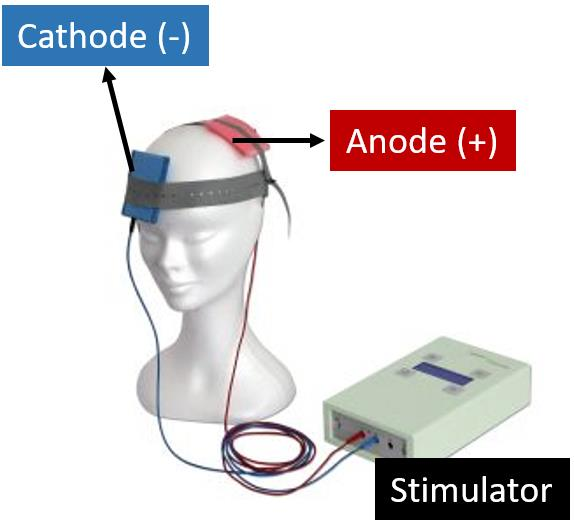

## What is tDCS?
tDCS (Transcranial Direct Current Stimulation) is a non-invasive and relatively painless brain stimulation technique that adjusts regional brain activity through modulating the transmembrane potential of neurons by sending low amplitude direct-current into the scalp. 
In healthy populations, anodal tDCS has been shown to increase cortical excitability while cathodal tDCS has been shown to inhibit cortical excitability.

## How is tDCS Done?
The electrode to be used is inserted into saline soaked sponges. The region where the electrode is to be placed is first wiped clean with alcohol wipes. Hair is then parted and the sponge is positioned over the marked position and secured in place using rubber straps. 
When ready, the experimenter uses the DC-stimulator to start the stimulation.

## What is tDCS used for?
Currently in our lab, we are investigating effects of tDCS on cognitive tasks (e.g. reading) and exploring changes in brain activity as a result of tDCS using fNIRS.
