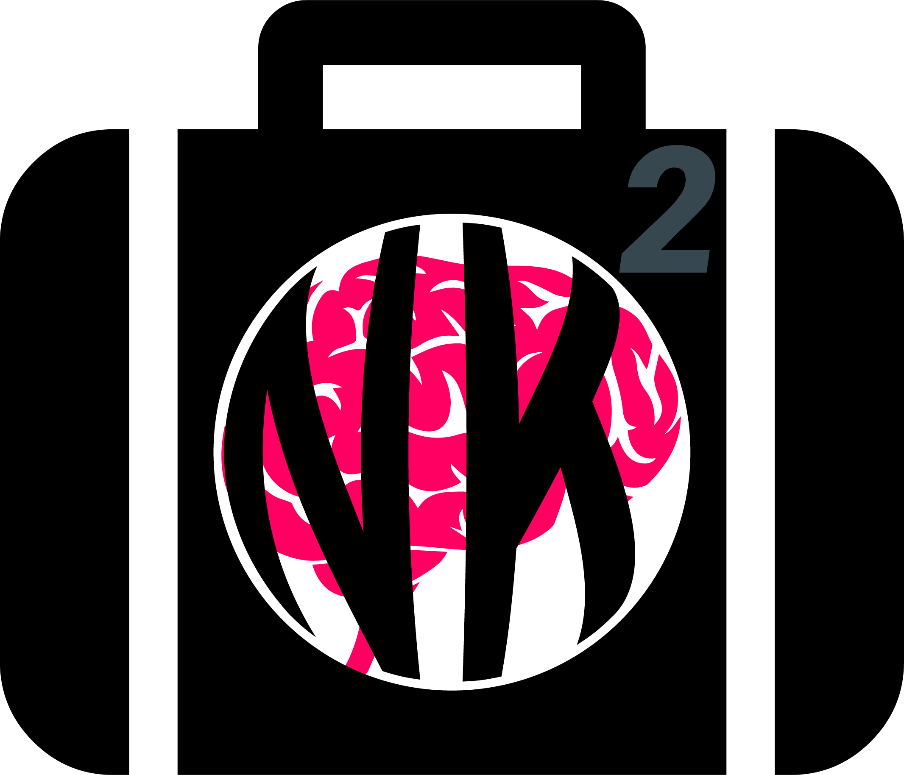

## Description

[NeuroKit2](https://github.com/neuropsychology/NeuroKit) is a [Python](https://www.python.org/) Toolbox for Neurophysiological Signal Processing.
Led by [Dr. Dominique Makowski](http://new.clinicalbrain.org/author/dominique-makowski/), NeuroKit2 is designed to be an open-source, community-driven, and user-centered Python package dedicated to advanced biosignal processing routines.
These bodily signals include electrocardiogram (ECG), electrodermal activity (EDA), respiration (RSP), electromyography (EMG), and electrooculography (EOG).
Researchers and clinicians without extensive knowledge of programming or biomedical signal processing can analyze physiological data with a few lines of code.

The package consists of comprehensive [documentation](https://neurokit2.readthedocs.io/en/latest/) which provides some guidelines on getting started with Python and some tutorials on data analysis.
Its functionalities include signal simulation, data management (e.g., downloading existing datasets, reading and formatting files into a dataframe), events extraction from signals, epochs extraction, signal processing (e.g., filtering, resampling, rate computation),
spectral analyses, complexity and entropy analyses, convenient statistical methods (e.g., K-means clustering, ICA or PCA).
Convenient plotting functions are also available, allowing for quick visualization of processed signals.

## Application

NeuroKit2 is currently used in our lab to analyze neurophysiological correlates of deception in the [Deception Project](http://new.clinicalbrain.org/project/deception/).

## Reference

Makowski, D., Pham, T., Lau, Z. J., Brammer, J. C., Lesspinasse, F., Pham, H., Schölzel, C., & S H Chen, A. (2020). NeuroKit2: A Python Toolbox for Neurophysiological Signal Processing. Retrieved March 28, 2020, from https://github.com/neuropsychology/NeuroKit
